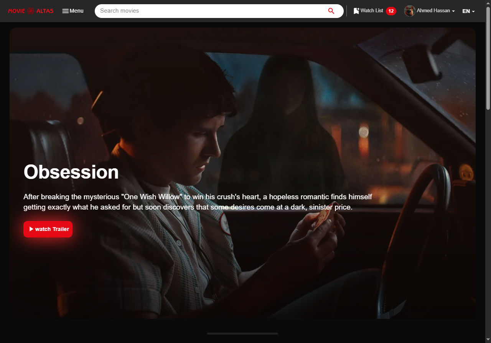
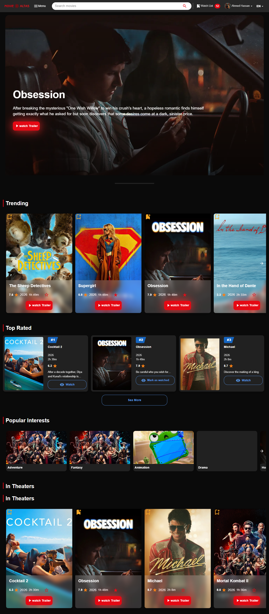
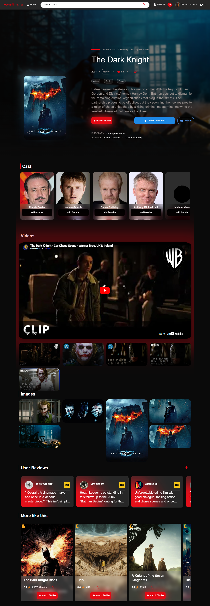
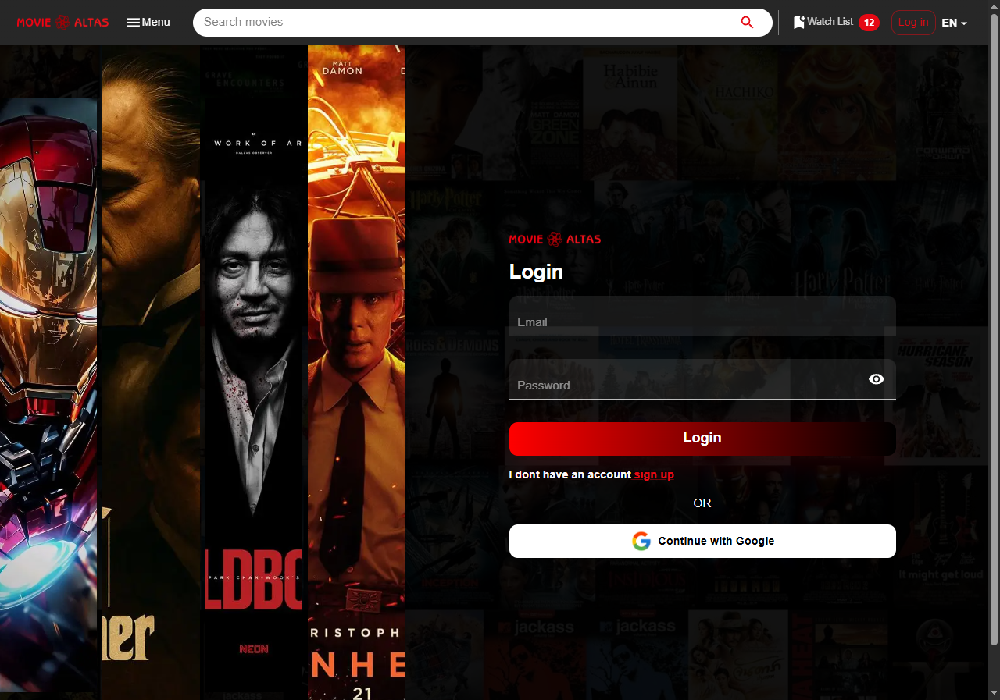
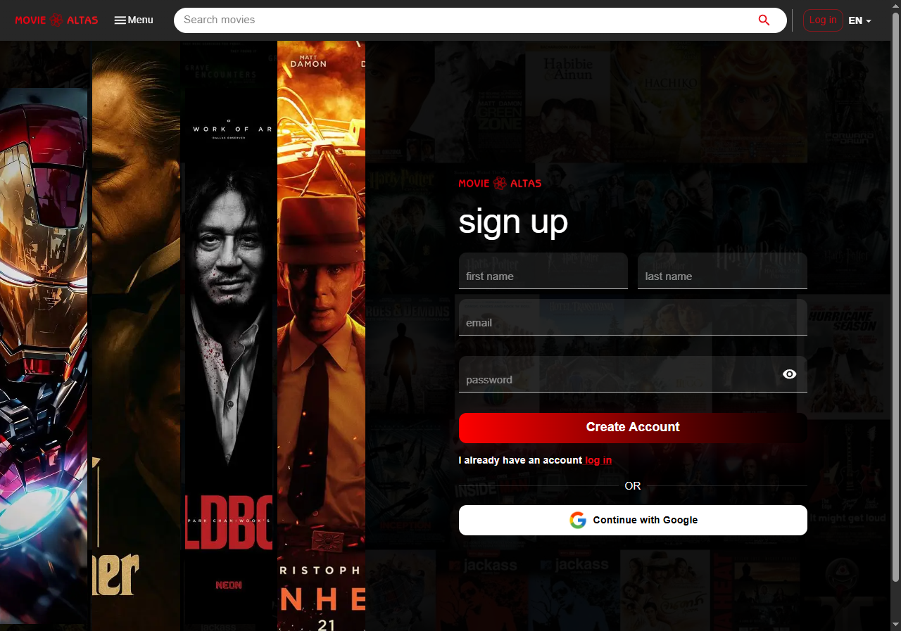

# 🎬 Movie Atlas

<p align="center">  </p>

<p align="center"> <strong>Discover, Explore, and Track Movies & TV Shows Like Never Before.</strong> </p>

<p align="center"> A modern movie discovery platform built with Next.js, NestJS, Prisma, PostgreSQL, Redis, GraphQL, and Microservices Architecture. </p>

<p align="center">      
 </p>

## 🚀 Live Demo

🔗 Frontend: [movieAtlas](https://movie-atlas-client.vercel.app) 

🔗 Backend API: [movieAtlasServer](https://movie-atlas-production.up.railway.app)

# ✨ Features
## 🔐 Auth System 
- Email verification using the verification code
- Login By Google 
- Create Account By Email and Password
- Auth by jwt
## 🎥 Movie & TV Discovery
- Browse trending movies and TV shows.
- Explore content by genre.
- View detailed information about titles.

## 🔎 Advanced Search
- Search movies, TV shows, actors, and genres.
- Fast search experience.

## 💖 Personalized Watchlist
- Save favorite titles.
- Manage your personal collection.

## 🎯 Interest-Based Recommendations
- Select favorite genres.
- Receive personalized recommendations.

## 🌍 Internationalization (i18n)
- Multi-language support.
- RTL & LTR support.
## ⚡ High Performance

- Server-side rendering (SSR).
- Increment server-site rendering (ISR).
- Static server-site rendering .
- Optimized API architecture.
 
## 🎬 Powered by TMDB

### Movie Atlas integrates with The Movie Database (TMDB) API to provide rich and up-to-date movie and TV show information, including:

- 🎥 Movies & TV Shows
- 🎭 Cast & Crew
- 🎬 Trailers
- 🖼️ Posters & Backdrops
- 📂 Genres
- 📺 Trending & Popular Titles

This product uses the TMDB API but is not endorsed or certified by TMDB.
## 🏗️ Architecture
- Client (Next.js)
- Server (Nestjs)
- DataBase (Postgresql)
- ORM (Prisma)
- Cache Redis
- File Storage (Cloudinery)
- Corn Job
## 🛠️ Tech Stack
### FrontEnd
- Nextjs
- Axios
- React-Query
- TypeScript
- Material UI
### BackEnd
- Nestjs
- Prisma
- Passportjs
- Nodemailer
- PostgreSQL
- Redis
### DevOps
- Docker
- Railway
- Vercel
## 📸 Screenshots
### Home Page

<p align="center">  </p>

### Movie Details 

<p align="center">  </p>

 ### Login Page 
<p align="center">  </p>
 
 ### Signup Page 
<p align="center"> </p>

## ⚙️ Installation
 git clone [GitHub](https://github.com/AhmedHassanDev1/movieAtlas)

 ### Frontend
 ```cmd
cd client
npm install
npm run dev
```
### Backend
```cmd
cd server
npm install
npm run start:dev
```
## 🌟 Why Movie Atlas?

### Most movie platforms focus only on displaying data.

##### Movie Atlas focuses on:

- Personalized recommendations.
- Modern architecture.
- High scalability.
- Fast user experience.
- Production-ready design.

## 📈 Future Roadmap

- [ ] AI Movie Recommendations

- [ ] Social Features

- [ ] User Reviews

- [ ] Real-Time Notifications

- [ ] Mobile Application

- [ ] Recommendation Engine
   
- [ ] Advanced Search (Elastic search)

## 🤝 Contributing

### Contributions are welcome.

#### Feel free to open issues, submit pull requests, or suggest new features   

## 📜 License

This project is licensed under the MIT License.

<p align="center"> Made with ❤️ by Ahmed Hassan </p>
